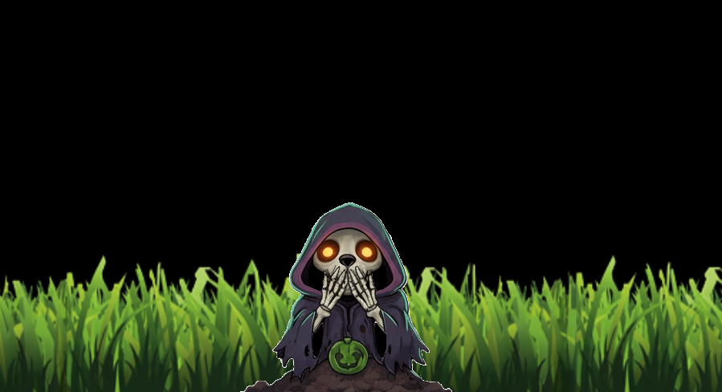
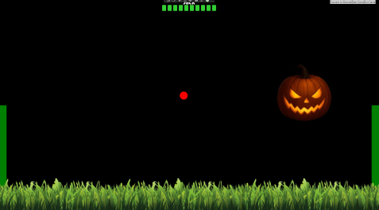
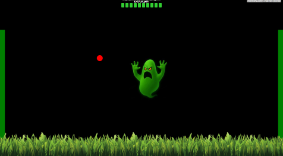
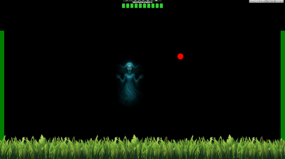
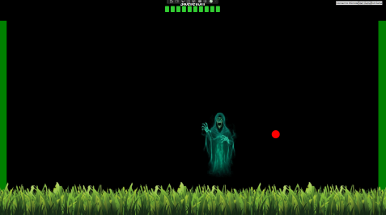
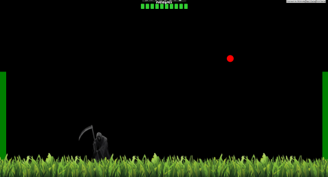
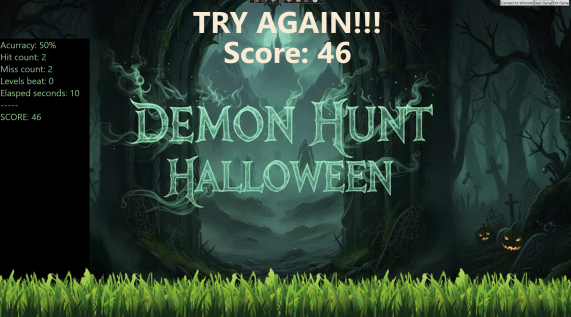

# DemonHuntHalloween
**DemonHuntHalloween** is a fun Halloween-themed "Duck Hunt" style game that can be played with a Wii remote or the mouse.  
The game features 5 exciting levels, each lasting at most 10 seconds, for a total playtime of no more than 50 seconds—perfect for Trunk-or-Treat parties.  
It was built using **C#** and **WPF**.

---

## Demo at Trunk-or-Treat Party

  
*Red dot aiming and shooting at enemies in action.*

  
*The skeleton dog laughs when you miss a target.*

---

## Level Characters

### Level 1
  
*Enemy: Jack.*

### Level 2
  
*Enemy: Booger.*

### Level 3
  
*Enemy: Ghost Girl.*

### Level 4
  
*Enemy: Skeleton.*

### Level 5
  
*Enemy: Reaper.*

---

## Score Screen

  
*Score breakdown displayed at the end of the game.*

---

## How to Use

You can play DemonHuntHalloween using a **Wii remote** or a **mouse**.

### Wii Remote

1. Pair your computer with the Wii remote via Bluetooth before starting the game.  
2. Launch DemonHuntHalloween and click **"Connect to Wiimote"**. Once connected, the button will be disabled.  
3. Click **"Start Game"** or press the **Home** button on the Wii remote to begin.

### Mouse

1. Click **"Start Game"** to play.  
2. Move the mouse to control the red dot.  
3. Click the left mouse button to shoot.

---

## Features

- Supports Wii remote or mouse input  
- Interactive Halloween-themed enemies  
- Dynamic scoring and health system  
- Fun sound effects and animations

---

## Acknowledgements

This project uses [WiimoteLib](https://github.com/BrianPeek/WiimoteLib) under the **MIT License**.  

For the full license text, see [`ThirdPartyLicenses.md`](ThirdPartyLicenses.md).

---

## License

DemonHuntHalloween is licensed under the **MIT License**. See the [`LICENSE`](LICENSE) file for details.
